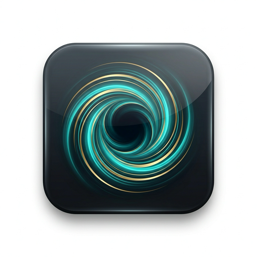

<div align="center">
  
  <h1>Gravity Chat</h1>
  <p><strong>A powerful, sleek, and minimalist AI chat application powered by Tauri and Ollama.</strong></p>

  <p>
    
    
    
  </p>
</div>

---

## ✨ Features

- 🚀 **Lightning Fast**: Built with Rust and Tauri for a native, high-performance experience.
- 🦙 **Ollama Integration**: Seamless support for local models (Llama 3, Mistral, etc.).
- ☁️ **Cloud Support**: Connect to Ollama Cloud using your API key.
- 📝 **Notes System**: Convert AI responses into rich-text notes with a built-in editor.
- 🎨 **Premium UI**: Modern dark-mode aesthetic with glassmorphism and smooth animations.
- 📐 **Math Support**: Full LaTeX rendering for mathematical expressions (KaTeX).
- 📂 **Organization**: Group your chats into folders.
- 💾 **Markdown Export**: Automatically saves your chats and notes as Markdown files.

## 📥 Installation

### macOS & Linux
Download the latest version from the **[Releases](https://github.com/Nikos-Unilasalle/Gravity-Chat/releases)** page.
- **macOS**: Download the `.dmg` file.
- **Linux (Generic)**: Use the `.AppImage` (standalone) or `.deb`.

### Arch Linux 🛸
Gravity Chat is ready for Arch Linux! You can build it using the provided `PKGBUILD`:
1. Clone the repo.
2. Run `makepkg -si`.

## 🛠️ Development

If you want to build Gravity Chat from source:

1. **Install dependencies**:
   ```bash
   npm install
   ```

2. **Run in development mode**:
   ```bash
   npm run tauri dev
   ```

3. **Build for production**:
   ```bash
   npm run tauri build
   ```

## ⚙️ Configuration

Ensure you have [Ollama](https://ollama.ai/) installed and running locally. The app defaults to `http://localhost:11434`.

## 📄 License

This project is licensed under the [MIT License](LICENSE).

---
<div align="center">
  Generated with ❤️ by Antigravity
</div>
